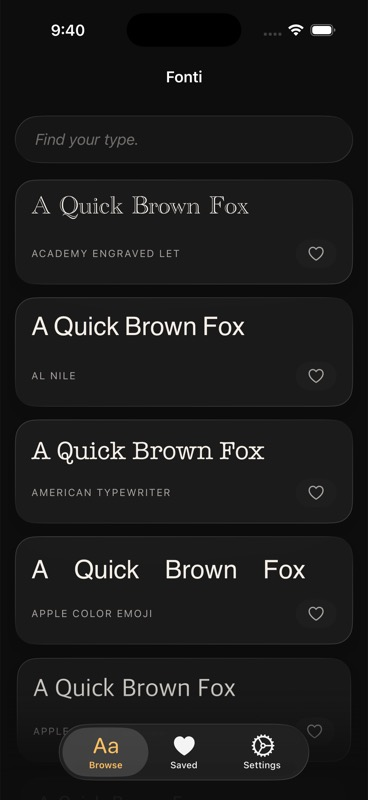
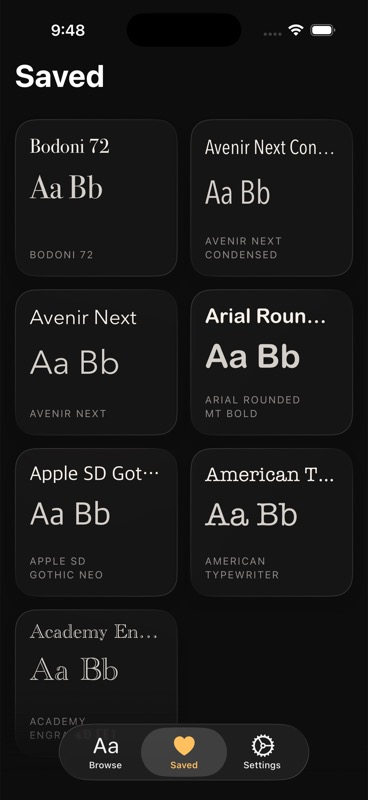
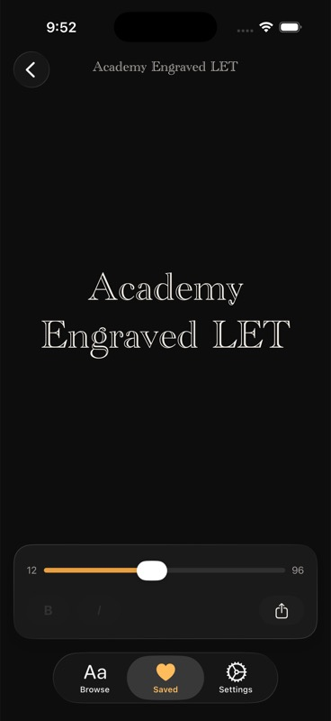
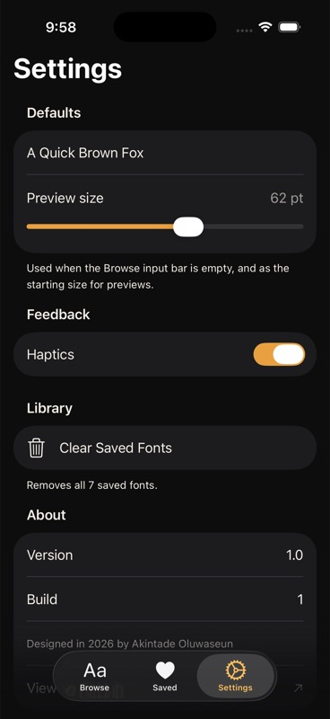

# Fonti

> *Find your type.*

A SwiftUI font previewer for designers, built for iOS 26+. Paste or type any text and see it rendered across every system font in a scrolling, premium gallery — save favourites, open them full-screen, share them as specimen images.

Liquid Glass throughout. SwiftData-backed. No third-party dependencies.

<p align="center">
  
  
  
  
</p>

---

## What's new in v1.1

- **Font Pairings** — A curated map of designer-approved heading + body combinations. Open the Full Screen Preview of a pairable family (Georgia, Helvetica Neue, Bodoni 72, Baskerville, Avenir Next, more) and you'll see a "Pairs well with…" strip of glass chips below the controls, each rendered in its own font. Tapping a chip *morphs* it into the new Preview via the same zoom transition Apple uses in Photos.
- **Custom Font Import** — A new **My Fonts** section in Settings opens the Files picker for `.ttf` or `.otf` files. Imported fonts are copied into the sandbox, registered with Core Text, and surfaced in Browse alongside the system fonts (with a small amber dot beside the caps label so designers can tell them apart). Swipe-to-delete in Settings removes them cleanly.

---

## Screens

<table>
<tr>
<td width="40%" valign="top">
  
</td>
<td width="60%" valign="top">

### Browse

A sticky liquid-glass input bar sits at the top — type or paste anything and every card below renders it in a different system font. Each card is a glass surface showing the family name in small caps, with a heart button that saves the font to your library.

- **Sticky glass input** pinned via `safeAreaInset(edge: .top)`
- **`LazyVStack` of font cards** — lazy realisation handles hundreds of system families smoothly
- **Text-change crossfade** as you type; **scroll fade-in** as cards enter the viewport
- **Per-card SwiftData query** keeps the heart state in sync with the Saved store
- Tapping a card triggers the **lift + parallax + zoom** transition into the Preview

</td>
</tr>

<tr>
<td width="40%" valign="top">
  
</td>
<td width="60%" valign="top">

### Saved

A two-column `LazyVGrid` of every font you've hearted. Each card shows the family name and an "Aa Bb" specimen rendered in that font.

- **`@Query(sort: \SavedFont.savedAt, order: .reverse)`** — most-recent first
- **Long-press → Remove** context menu (with a snappy scale + opacity transition)
- **Empty state**: a quiet *"Heart a font to keep it here."* in cream-50%
- Tapping a card pushes the same Preview screen as Browse, with the same lift transition

</td>
</tr>

<tr>
<td width="40%" valign="top">
  
</td>
<td width="60%" valign="top">

### Full Screen Preview

A large centred render of your text in the selected family. The navigation title itself is rendered in the family font — the screen *is* the specimen.

- **Glass control capsule** at the bottom: 12–96 pt size slider, bold / italic glass toggles, share button
- **Bold/italic detection** via `UIFontDescriptor` — toggles are always visible but greyed at 35% opacity when the family doesn't support that trait (no layout shift between fonts)
- **Share** generates a 1080×1080 specimen PNG via `ImageRenderer` and hands it off to `ShareLink`
- Default starting size comes from Settings

</td>
</tr>

<tr>
<td width="40%" valign="top">
  
</td>
<td width="60%" valign="top">

### Settings

A clean Form-based screen, all `@AppStorage`-backed.

- **Defaults** — a sample text that replaces the family-name fallback on Browse, and a preview size that becomes the starting value for the Full Screen Preview slider
- **Feedback** — Haptics toggle (light impact on lift-tap, selection on heart-toggle, gated by this setting)
- **Library** — destructive *Clear Saved Fonts* button with a confirmation alert, count-aware footer
- **About** — version + build pulled from `Info.plist`, designer credit, GitHub link

</td>
</tr>
</table>

---

## Built with

- **SwiftUI** — every screen, including the iOS 26 `Tab(_:systemImage:)` API and `.tabBarMinimizeBehavior(.onScrollDown)`
- **Liquid Glass** — `.glassEffect(in:)`, `.buttonStyle(.glass)`, native glass tab bar
- **SwiftData** — `@Model class SavedFont` with `@Attribute(.unique)` on `familyName`
- **`ImageRenderer`** — 1080×1080 specimen export at scale 3
- **`@AppStorage`** — settings persistence
- **`.matchedTransitionSource` + `.navigationTransition(.zoom(sourceID:in:))`** — paired with a custom source-side lift + parallax for the card-to-preview transition
- **`.sensoryFeedback(_:trigger:)`** — toggleable haptics
- No third-party dependencies

## Architecture

```
Fonti/
├── App/
│   ├── FontiApp.swift              // @main, SwiftData modelContainer
│   └── RootView.swift              // TabView host
├── Theme/
│   ├── FontiColors.swift           // ink / cream / amber tokens
│   └── CardLiftEffect.swift        // shared lift+parallax modifier
├── Models/
│   └── SavedFont.swift             // @Model, @Attribute(.unique)
├── Services/
│   ├── SystemFontProvider.swift    // UIFont.familyNames → [FontFamily]
│   ├── FontTraitSupport.swift      // bold/italic detection
│   └── SpecimenRenderer.swift      // ImageRenderer-based 1080×1080 PNG
├── Features/
│   ├── Browse/                     // BrowseView, BrowseModel, FontCard
│   ├── Preview/                    // FullScreenPreviewView, PreviewControls
│   ├── Saved/                      // SavedFontsView, SavedFontCard
│   └── Settings/                   // SettingsView, AppAppearance
└── Assets.xcassets                 // AppIcon
```

## Run it

Requires **Xcode 26** and **iOS 26.2+** simulator (or device).

```bash
git clone https://github.com/tade-dev/Fonti.git
cd Fonti
open Fonti.xcodeproj
```

Pick the **iPhone 17 (iOS 26.2)** simulator and ⌘R.

## Credits

Designed and built in 2026 by **Akintade Oluwaseun**. App icon is an *Aa* type specimen set in Apple's New York serif — cream A + amber a, with a small *F O N T I* wordmark in caps below, on the brand ink (#0D0D0D).
